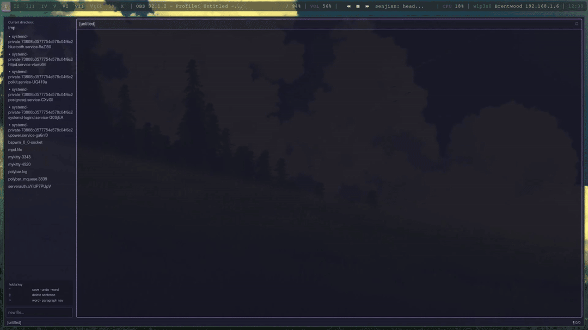

# flow-state

## Main features

- **Focus-first writing.** The paragraph you are writing stays in full color
  while everything else is dimmed, helping you stay focused on the current
  thought.
- **Sentence phantoms.** `SHIFT+BACKSPACE` turns the current sentence into
  dimmed phantom text instead of permanently deleting it. Type to rewrite it,
  press `TAB` to restore it, or press `SHIFT+BACKSPACE` again to discard it.
  Phantoms are never saved to disk.
- **Live previews.** Markdown is rendered natively, while LaTeX is compiled
  into a continuously scrollable preview with `CTRL+scroll` zooming.
- **Local spell checking.** Misspellings are quietly underlined after typing
  pauses. `CTRL+.` jumps to a misspelling and opens corrections or dictionary
  suggestions. Document text is never sent to a service.
- **Keyboard-first editing.** Navigate, delete, correct, save, and manage the
  editor without leaving the keyboard. A live cheat-sheet changes with the
  modifier key you hold.
- **Flexible workspace.** Files open in separate editor panes, previews follow
  the focused editor, and panes can be swapped, resized, maximized, or closed.

## Keybindings

| Key | Action |
|---|---|
| Arrows / CTRL+arrows / mouse | Standard movement & selection |
| `CTRL+H` / `CTRL+J` / `CTRL+K` / `CTRL+L` | Move left / down / up / right |
| `ALT+W` / `ALT+B` | Next / previous word |
| `ALT+N` / `ALT+SHIFT+N` | Next / previous paragraph |
| `CTRL+BACKSPACE` | Delete previous word (or trim a phantom's last word) |
| `SHIFT+BACKSPACE` | "Delete" the current sentence into a phantom |
| `TAB` | Accept the active phantom (else insert a tab) |
| `CTRL+Z` / `CTRL+SHIFT+Z` / `CTRL+Y` | Undo / redo |
| `CTRL+S` | Save, then refresh/compile the preview |
| `CTRL+O` | Open a file, or choose a folder as the current directory |
| `CTRL+.` | Correct the misspelled word at the cursor |
| `CTRL+C/X/V` | Clipboard |
| `ESC` | Open the command bar / go back / close |

## Still to cover

- What flow-state is, who it is for, and why it exists.
- Installation, system requirements, and a short getting-started example.
- File, pane, and sidebar navigation.
- Configuration, themes, and the command bar.
- Current limitations and planned features.
- Contributing, issue reporting, licensing, and Halloy attribution.
